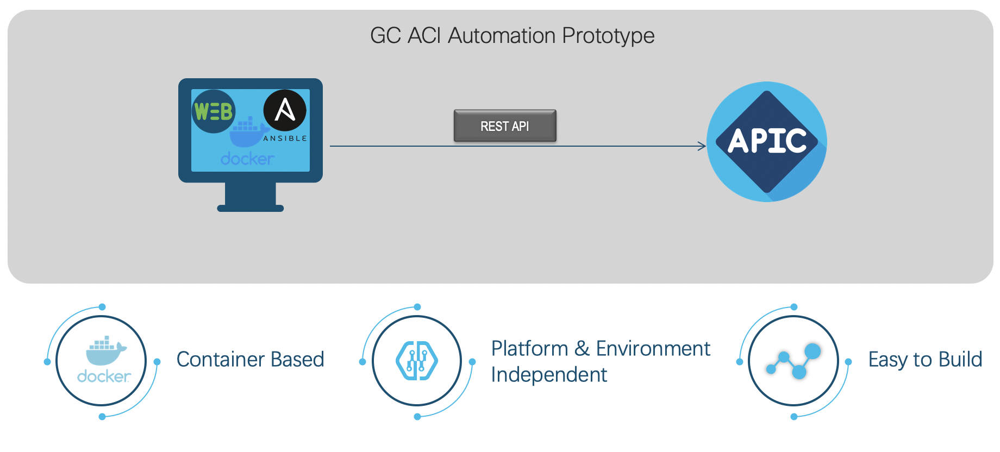
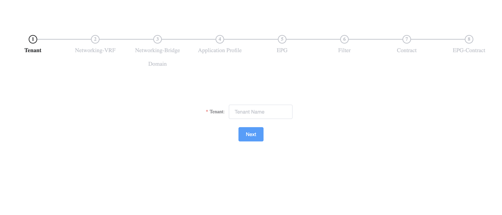

Cisco ACI Auto Config Web App
===

ACI Automation Configuration Web App:

Container(Web App + Python3 + Ansible2.10.1)= Cisco ACI Automation Configuration Web App

[](https://travis-ci.com/GC-ACI-Automation-Group/aci_auto_config_web)

Requirements
===

1. Cisco APIC 4.1+

2. Docker Desktop

3. Following the below contents, to create and save a text file named “inventory” at anywhere you want, which used to store the credentials and ip address/domain name of the APIC you want to configure, remember the absolute path of the file as we will use it in the later steps.

```bash
[apic:vars]
username=admin
password=ciscopsdt

[apic]
sandboxapicdc.cisco.com
```
Note: the credentials displayed above is for the APIC from Cisco DevNet Sandbox always-on lab for your reference and testing!

4. Git (optional, used to clone container image)

This is the components you need to use this app in your local environment.

For the codes, please check:https://github.com/GC-ACI-Automation-Group/aci_auto_config_web


Description
===

Cisco ACI（Application Centric Infrastructure）is an industry leading datacenter SDN solution, it can automatically deploy application policy to infrastructure, make customer’s datacenter network more flex and agile. But it is a little difficult to new user familiar with APIC configuration GUI.

We are planning to develop an application to help our new ACI customer very quickly and easily to deploy their ACI fabric. Our application is built on the top to container, so customer can get the identical environment at anytime and anywhere, it can deploy very quickly. After that customer can use this web application configuration policy on Cisco APIC automatically with one simple navigation flow instead of clicking many different menu buttons under the APIC GUI. It will make ACI more friendly to new user.

How it works
===



In order to use this web app, there are two step to do. 

Note:  

   <your_localhost_port> stands for the port of the computer on which the web app will be run, like 80 or 8080.
   
   </path/inventory> means the absolute path used to store the file named inventory, such as C:/inventory, which means that you stored the inventory file under drive C:

Step 1, Building The Web App Container:
===

 Option 1. To Build & Run The Container From https://hub.docker.com/ Remotely
 

 ```bash
 docker run -d -p <your_localhost_port>:80 -v </path/inventory>:/inventory jinyuansi/aci_auto_config_web
 ```

 Option 2. To Build & Run The Container By Yourself With The Following CMD


 1>. clone the git file to local 

 ```bash
 git clone https://github.com/GC-ACI-Automation-Group/aci_auto_config_web.git
 ```

 2>. go to the aci_auto_config_web directory

 ```bash
  cd aci_auto_config_web/
```

 3>. build the docker image

 ```bash
 docker build -t aci_auto_config_web .
 ```

 4>. run the service

 ```bash
 docker run -d -p <your_localhost_port>:80 -v </path/inventory>:/inventory aci_auto_config_web
 ```
 
Step 2. To Access The Web App With Browser For Your APIC Configuration:
===

http://localhost:<your_localhost_port>




Congratulation to you! Begin your new experience journey in ACI configuration.
